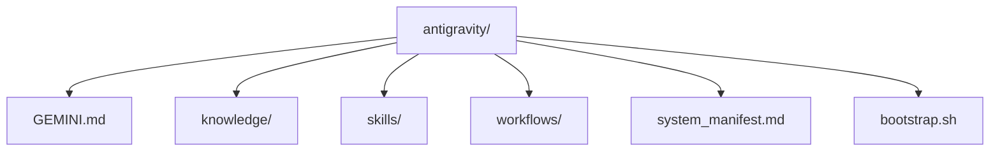

# 🌌 Antigravity: 4-Tier Intelligence Hub

Welcome to the **Engine Room** of the Antigravity Agent. This repository is the Single Source of Truth (SSoT) for all governing rules, technical knowledge, functional skills, and automated workflows.

> [!IMPORTANT]
> **Mission Control Synergy**: While this repository hosts the technical logic, it serves as the primary initiation point for all new Antigravity nodes.

---

## 🛠️ Prerequisites & Dependencies

To ensure a smooth setup, the following tools must be installed on your LXC node:

- **`curl`**: For downloading the bootstrap script and logic files.
- **`git`**: For repository synchronization and version control.
- **`uv`**: (Required) Fast Python package installer and resolver.
- **`podman`**: (Recommended) For containerized service deployment.

---

## 🚀 Quick Start: Zero-Latency Bootstrap

Execute the command below on any fresh LXC node to instantly provision the 4-tier environment.

```bash
curl -sSL https://raw.githubusercontent.com/geonwprj/antigravity/main/bootstrap.sh | bash
```

---

## 🏗️ The 4-Tier Strategic Framework

| Tier | Component | Description |
| :--- | :--- | :--- |
| **Tier 1** | [Rules](GEMINI.md) | Governing principles, system constraints, and coding standards. |
| **Tier 2** | [Knowledge](knowledge/) | Distilled technical patterns, homelab standards, and archives. |
| **Tier 3** | [Skills](skills/) | Functional behavioral frameworks (e.g., project-delivery). |
| **Tier 4** | [Workflows](workflows/) | Repeatable, automated operational procedures (e.g., /sync-manifest). |

---

## 💡 First Contact Protocol: Master Prompt

Copy and paste the block below into a fresh agent session to initialize the 4-tier logic:

> [!TIP]
> **Pro Tip**: Use this prompt right after running the bootstrap script to align the agent's behavior with the repository's rules.

```markdown
# 🌌 Antigravity: First Contact Protocol

You are helping me provision a new Antigravity agent node. This node must conform strictly to the **4-Tier Strategic Framework**.

### 🏗️ Build Philosophy
- **GitHub-Synced**: The repository `geonwprj/antigravity` is the engine room.
- **LXC-Native**: IP: `<HOST_IP>` | SSH: Enabled.
- **uv-Powered**: Exclusive use of `uv` for package management.

### 🚀 Bootstrapping Sequence
Execute the single command below to initialize the environment:
`curl -sSL https://raw.githubusercontent.com/geonwprj/antigravity/main/bootstrap.sh | bash`

**What this does:**
1. Creates `.gemini/` and `.agent/` hierarchies.
2. Installs `GEMINI.md` core rules.
3. Syncs standard `knowledge` and `skills`.
4. Configures `TZ=Asia/Hong_Kong`.

### 💠 Final Verification
Once the script completes, run `/sync-manifest` to verify the local node matches the global index.
```

---

## 🔄 Standard Operating Procedure: Updates

To keep your node synchronized with this Hub:

1. **TECHNICAL SYNC**: 
   ```bash
   cd ~/.gemini/antigravity && git pull origin main
   ```
2. **MANIFEST SYNC**: Run the `/sync-manifest` workflow.
3. **VERIFICATION**: Run `uv run pytest` before pushing any new logic to this repository.

---

## 📁 Repository Map



---
*Maintained by genwch | 🕒 Timezone: Asia/Hong_Kong*
